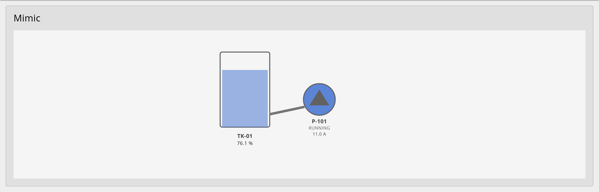
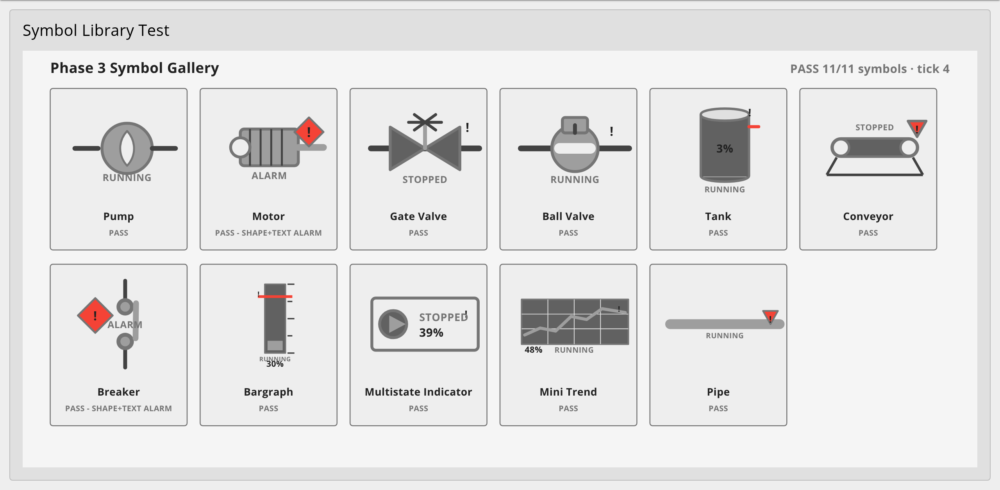
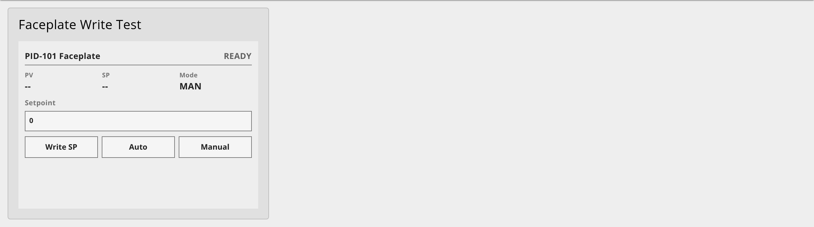

# node-red-dashboard-2-scada-kit

> HP-HMI / SCADA widget kit for [Node-RED Dashboard 2.0](https://github.com/FlowFuse/node-red-dashboard) — SVG synoptic displays, equipment faceplates, and an ISA-101-styled symbol library.

[](LICENSE)
[](https://nodered.org)
[](https://github.com/FlowFuse/node-red-dashboard)

---

> **Status: 🚧 Pre-release — core, mimic, symbols, and faceplate all functional and verified live in Node-RED Dashboard 2.0.** Packages are not yet published to npm; install from source.

---

## What You Get

A single package — [`@jsgorana/node-red-dashboard-2-scada`](https://www.npmjs.com/package/@jsgorana/node-red-dashboard-2-scada) — providing two Dashboard 2.0 nodes plus a bundled symbol library:

| Node | Description |
|------|-------------|
| `ui-scada-mimic` | Render a process SVG with declarative tag bindings — no per-screen JavaScript |
| `ui-scada-faceplate` | Equipment faceplates (motor, valve, PID) with write-confirmation and RBAC |

The binding DSL + SVG sanitizer + ISA-18.2 alarm FSM (the former `core` library) and the HP-HMI **SVG symbol library** (pumps, valves, tanks, breakers, gauges) are bundled in. The symbols are also importable directly: `require('@jsgorana/node-red-dashboard-2-scada/symbols')`.

The kit is **protocol-agnostic** — it consumes normalized tag values from any upstream Node-RED node (OPC UA, Modbus, MQTT, Sparkplug, etc.) and does not bundle drivers.

## Screenshots

All captured live from Node-RED Dashboard 2.0.

### Mimic — `ui-scada-mimic`

A process SVG driven entirely by declarative tag bindings: the tank fills from the bottom up, and the pump turns blue / shows `RUNNING` + amps when its tag is active.



### Symbol library *(bundled)*

ISA-101 / HP-HMI symbols — color only signals the abnormal, with redundant shape + text so state never relies on color alone. Alarms use a red diamond plus an `ALARM` label.



### Faceplate — `ui-scada-faceplate`

Equipment faceplate (PID shown) with setpoint entry, mode buttons, a client-side write-confirmation step, and **server-side RBAC** — browser-asserted roles are never trusted; unauthorized writes are denied and audited.



## Standards compliance

| Standard | Coverage |
|----------|----------|
| ISA-101 / High-Performance HMI | Display hierarchy, gray palette, color-for-abnormal-only, shape+label redundancy |
| ISA-18.2 / IEC 62682 | Full 7-state alarm lifecycle, priority distribution, ack/shelve |
| IEC 62443-4-1 / 4-2 | Secure SDL, RBAC, audit logging, SVG sanitization, SBOM |
| OWASP Top 10:2021 | XSS (A03) via DOMPurify + CSP; access control (A01) server-side deny-by-default |
| WCAG 2.2 AA | Keyboard operability, target size, focus, contrast, not color-alone |

## Requirements

- Node.js `>=20.0.0`
- Node-RED `>=4.0.0`
- `@flowfuse/node-red-dashboard` `>=1.0.0` (Dashboard 2.0)

## Installation

> *(Not yet published — install from source during development)*

### Palette Manager *(once published)*

1. Open **Menu → Manage palette → Install**
2. Search `@jsgorana/node-red-dashboard-2-scada`
3. Click **Install** — both nodes are added.

### npm *(once published)*

```bash
npm install @jsgorana/node-red-dashboard-2-scada
```

### Local development (Docker)

```bash
./scripts/dev-install.sh
```

See [scripts/dev-install.sh](scripts/dev-install.sh) for details.

## Repository structure

```
packages/
  scada/         @jsgorana/node-red-dashboard-2-scada  (the single published package)
    nodes/       ui-scada-mimic + ui-scada-faceplate (Node-RED runtime + editor)
    ui/          Vue widget sources (mimic, faceplate)
    lib/         binding DSL, SVG sanitizer, alarm FSM, theme tokens
    symbols/     HP-HMI SVG symbol library + catalog
    resources/   built widget UMDs
    examples/    importable flows: mimic-tank-pump.json, faceplate-pid-rbac.json
docs/            Binding DSL reference, symbol catalog, getting-started tutorial
scripts/         Developer tooling
```

## Examples

The package ships two importable, self-contained example flows. Once installed, open **Menu → Import → Examples → @jsgorana/node-red-dashboard-2-scada**, or import the JSON directly:

| Example | Shows |
|---------|-------|
| [`mimic-tank-pump.json`](packages/scada/examples/mimic-tank-pump.json) | A tank + pump mimic driven by declarative tag bindings (level fill, pump color/status/amps). |
| [`faceplate-pid-rbac.json`](packages/scada/examples/faceplate-pid-rbac.json) | A PID faceplate with setpoint entry, write-confirmation, and server-side RBAC + audit (outputs 1 = allowed write, 2 = audit). |

Both bundle their own Dashboard base/theme/page/group, so they render immediately on import. They are protocol-agnostic — swap the `inject` + `function` simulators for your real OPC UA / Modbus / MQTT source.

## Documentation

- [Getting started](docs/getting-started.md) — install, import the example, build your own mimic, add a faceplate.
- [Binding DSL reference](docs/binding-dsl.md) — every target type and transform stage, with worked examples.
- [Symbol catalog](docs/symbol-catalog.md) — the HP-HMI symbol library and each symbol's bindable element ids.
- [Publishing & flows.nodered.org](docs/publishing.md) — release runbook for maintainers.

## Acknowledgements

This kit builds on and is inspired by several outstanding open-source projects and standards. See [NOTICE](NOTICE) for the full list.

Key acknowledgements:
- **[Node-RED](https://nodered.org)** — OpenJS Foundation
- **[Node-RED Dashboard 2.0](https://github.com/FlowFuse/node-red-dashboard)** — FlowFuse Inc.
- **[node-red-contrib-ui-svg](https://github.com/bartbutenaers/node-red-contrib-ui-svg)** — Bart Butenaers *(binding model inspiration)*
- **[DOMPurify](https://github.com/cure53/DOMPurify)** — Cure53 *(SVG sanitization)*
- **ISA-101, ISA-18.2, IEC 62443, WCAG 2.2** — standards that define the compliance targets

## Contributing

See [CONTRIBUTING.md](CONTRIBUTING.md). Security issues: see [SECURITY.md](SECURITY.md).

## License

[Apache-2.0](LICENSE) © 2026 jsgorana
