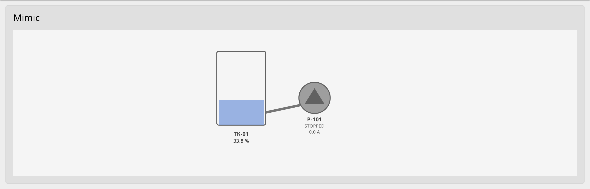
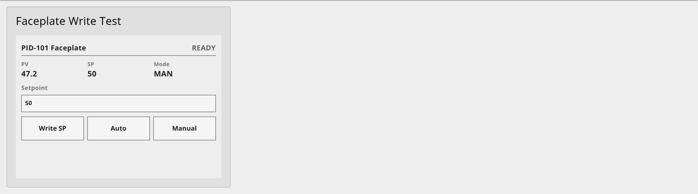

# @jsgorana/node-red-dashboard-2-scada

> HP-HMI / SCADA widget kit for [Node-RED Dashboard 2.0](https://github.com/FlowFuse/node-red-dashboard) — SVG synoptic/mimic displays and equipment faceplates, driven by declarative tag bindings. ISA-101 styled, with a built-in symbol library.

[](LICENSE)
[](https://nodered.org)
[](https://github.com/FlowFuse/node-red-dashboard)

One package, two Dashboard 2.0 nodes:

| Node | What it does |
|------|--------------|
| **`ui-scada-mimic`** | Render a process SVG and animate it from tag values — fill levels, colors, text, visibility, rotation — with **no per-screen JavaScript**. |
| **`ui-scada-faceplate`** | Equipment faceplate (motor / valve / PID) with setpoint entry, write-confirmation, and **server-side RBAC + audit**. |

A library of ISA-101 / HP-HMI SVG symbols (pump, motor, valves, tank, conveyor, breaker, bargraph, multistate indicator, mini-trend, pipe) is bundled in.



The kit is **protocol-agnostic** — it consumes a normalized tag map from any upstream node (OPC UA, Modbus, MQTT, Sparkplug, …) and bundles no drivers.

## Install

```bash
npm install @jsgorana/node-red-dashboard-2-scada
```

Or via **Menu → Manage palette → Install** and search for the package name. Requires Node-RED `>=4.0`, Node.js `>=20`, and `@flowfuse/node-red-dashboard` `>=1.0` (Dashboard 2.0). Both nodes appear in the palette under the **dashboard 2** group alongside the stock widgets.

## Quick start

Import a bundled example — **Menu → Import → Examples → @jsgorana/node-red-dashboard-2-scada** → **mimic-tank-pump** or **faceplate-pid-rbac** — and deploy.

A minimal mimic binding set:

```json
{
  "bindings": [
    { "selector": "#TK01_fill", "source": "TK01.level",
      "target": { "type": "level", "axis": "y", "max": 152 },
      "transform": { "default": "0", "quality": { "onBad": "0" } } },
    { "selector": "#P101_body", "source": "P101.run",
      "target": { "type": "style", "name": "fill" },
      "transform": { "valueMap": { "true": "#5c85d6", "false": "#9e9e9e" }, "default": "#bdbdbd" } }
  ]
}
```

Feed the node a tag map:

```js
msg.payload = { "TK01.level": 76.1, "P101.run": true };
return msg;
```

## Faceplate writes & RBAC

The faceplate gates operator writes: a client-side confirmation, then **server-side authorization** (browser-asserted roles are never trusted). Output 1 is the allowed write/state; output 2 is the audit stream (emitted for both allowed and denied writes). Map Dashboard authentication and the node's allowed roles (`operator` / `supervisor` / `engineer`) to permit real writes.



## Symbol library

The bundled HP-HMI symbols are accessible programmatically:

```js
const { catalog, getSymbol } = require('@jsgorana/node-red-dashboard-2-scada/symbols');
```

Each symbol has documented, bindable element ids (status text, value text, level, alarm shape/text). See the [symbol catalog](https://github.com/jsgorana/node-red-dashboard-2-scada-kit/blob/main/docs/symbol-catalog.md).

## Documentation

- [Getting started](https://github.com/jsgorana/node-red-dashboard-2-scada-kit/blob/main/docs/getting-started.md)
- [Binding DSL reference](https://github.com/jsgorana/node-red-dashboard-2-scada-kit/blob/main/docs/binding-dsl.md)
- [Symbol catalog](https://github.com/jsgorana/node-red-dashboard-2-scada-kit/blob/main/docs/symbol-catalog.md)

## License

[Apache-2.0](LICENSE) © 2026 jsgorana. See [NOTICE](NOTICE) for acknowledgements.
